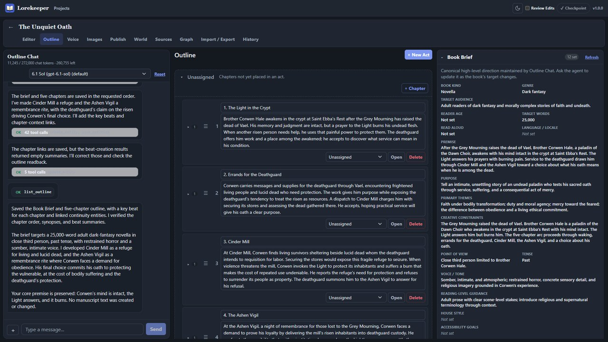
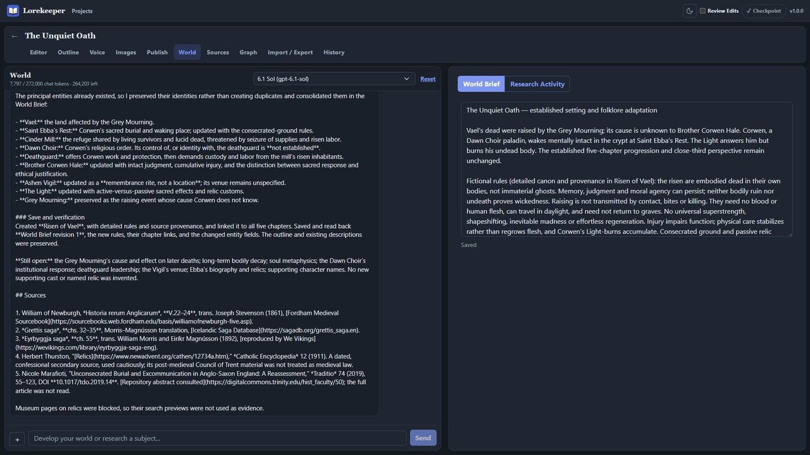
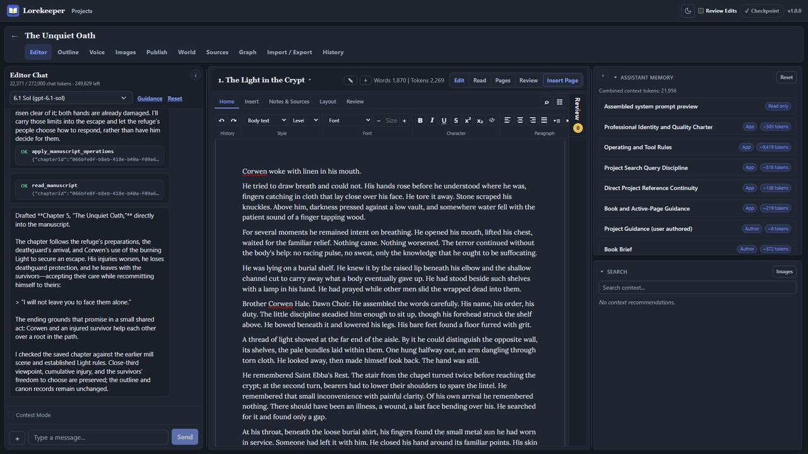
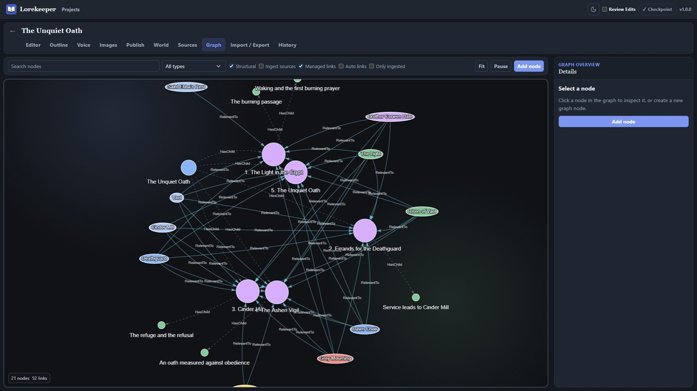
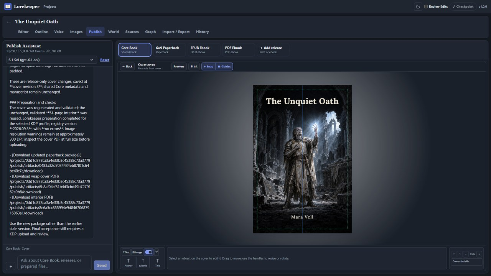
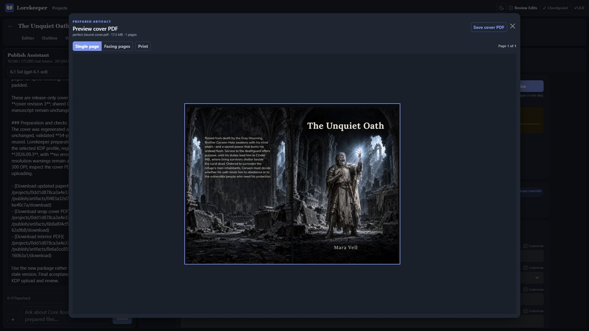
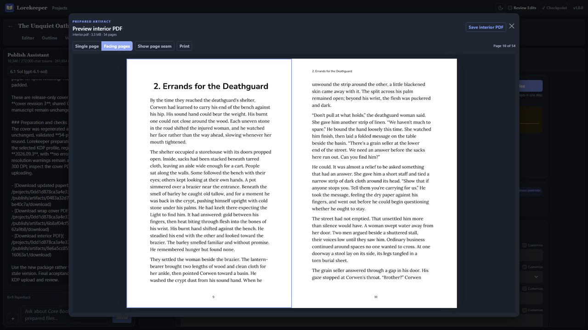
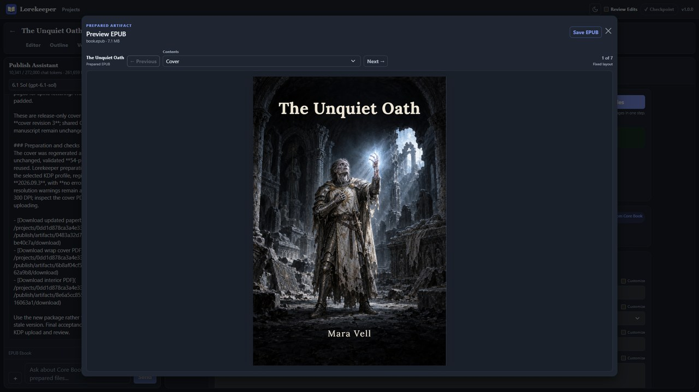
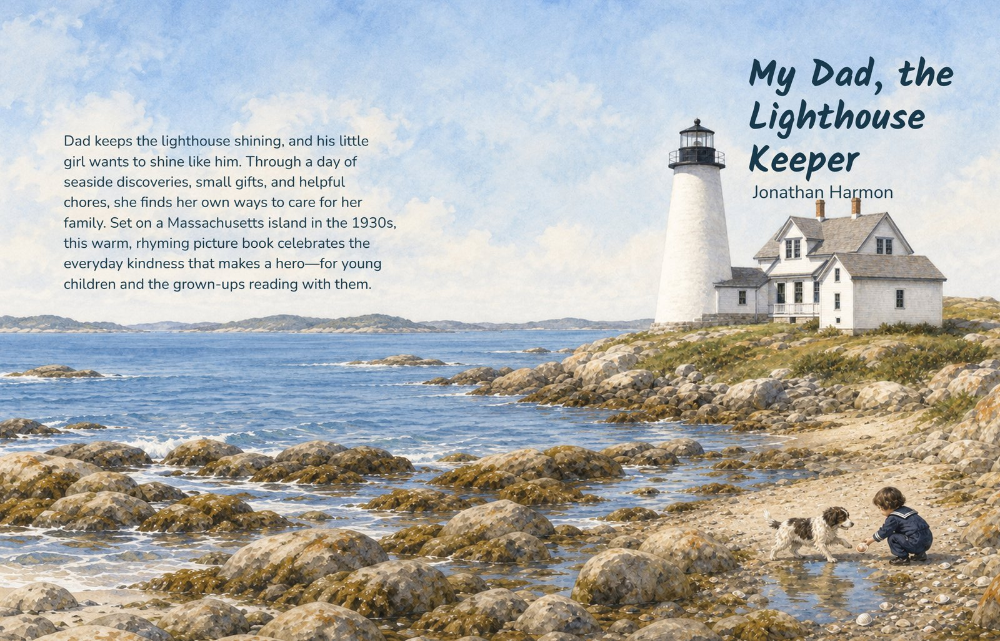
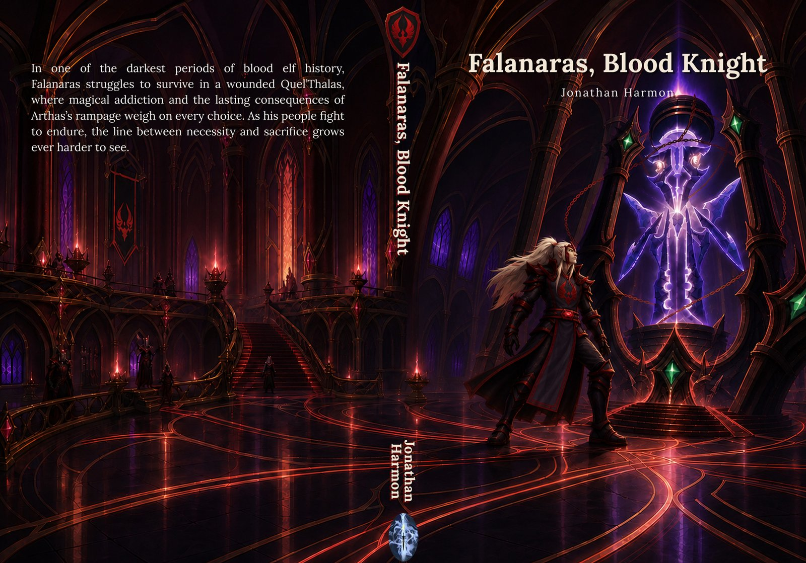

# Lorekeeper

**An AI-assisted book studio where you stay the author, from first premise to
print-ready files.**

Lorekeeper's assistants plan, draft, and revise inside an organized project
while you keep control of the details: review and approve each change they
make, edit everything directly, and keep your outline, story facts, and sources
in order. Connect your OpenAI account to use its chat, image, and embedding
models right in the workspace. When the book is ready, Lorekeeper produces EPUB,
PDF ebook, and print-ready paperback and hardcover files, including full-wrap
covers measured to the final spine, with its own built-in renderer and no
licensed PDF software. Everything stays in one project on your own computer.

[](https://buymeacoffee.com/dorely)

https://github.com/user-attachments/assets/64498034-7feb-4a12-a66c-748eeffa59f9

The 90-second [trailer](media/trailer/README.md) is one live end-to-end run in a
synthetic project, from premise to prepared book files, with captions,
provenance, and a reproducible export recipe.

## Highlights

- **AI authorship you direct:** six assistants (Outline, Editor, Voice, World,
  Images, and Publish) work directly in your outline, chapters, story graph, and
  pages. Turn on Review Edits to approve or undo each change they make, and
  revise every word yourself in a structured chapter editor.
- **Your OpenAI account, built in:** connect once to use OpenAI chat, image, and
  embedding models across the workspace. OpenAI-compatible providers and local
  model servers also work.
- **Manuscript to finished book:** one Core Book becomes paperback, hardcover,
  EPUB, and PDF ebook releases, with covers sized to the calculated spine and
  print profiles for Amazon KDP, IngramSpark, Barnes & Noble Press, and Lulu, or
  your own printer's measurements. Lorekeeper's built-in renderer produces and
  validates the PDFs without a licensed PDF engine.

Everything else supports those three:

- **Organize:** outline, Book Brief, a story graph of characters, places, and
  events, project facts, and read-only links to earlier books in a series.
- **Research and world building:** import PDF, EPUB, Word, image, and
  saved-webpage sources with stable citations, and build a living World Brief
  with web research.
- **Voice and writing samples:** build character dialogue and point-of-view
  profiles, and give the Editor samples of your own prose to match.
- **Write and edit:** Book Text Styles, Figures, tables, footnotes, citations,
  DOCX import, and a true paginated Read preview.
- **Images and design:** generate and edit artwork, keep canonical character
  and location references, and compose Designed Pages and covers on a canvas.
- **History:** local checkpoints with readable comparisons and restore, plus
  optional sync to your own GitHub repository.
- **Your data stays local:** projects live in local SQLite, move between
  machines as `.lorekeeper` archives, and need no Lorekeeper account.

## Screenshots

| | |
|---|---|
|  |  |
| Plan with an outline assistant and a living Book Brief. | Research your world with cited sources. |
|  |  |
| Write and revise with an assistant that works in your manuscript. | See characters, places, and chapters in a story graph. |
|  |  |
| Design covers on a canvas with your own art and type. | Prepare print-ready full-wrap covers. |
|  |  |
| Preview the typeset print interior in facing pages. | Preview the EPUB before you publish. |

## Example books

Two complete print packages made in Lorekeeper, committed exactly as the app
saved them. See [examples](examples/README.md) for details.

| | |
|---|---|
| [](examples/README.md#my-dad-the-lighthouse-keeper) | [](examples/README.md#falanaras-blood-knight) |
| **My Dad, the Lighthouse Keeper**: a full-color 8.5 × 11 in picture book with full-bleed illustrated spreads. [Interior](examples/my-dad-the-lighthouse-keeper/interior.pdf) · [Cover](examples/my-dad-the-lighthouse-keeper/outside-cover.pdf) | **Falanaras, Blood Knight**: a 6 × 9 in black-and-white novel (unofficial Warcraft fan fiction). [Interior](examples/falanaras-blood-knight/interior.pdf) · [Cover](examples/falanaras-blood-knight/outside-cover.pdf) |

## Installation

Download the latest release from
[Dorely/Lorekeeper releases](https://github.com/Dorely/Lorekeeper/releases).
v1.0.0 is also published to the
[historical download repository](https://github.com/Dorely/Lorekeeper-Releases/releases)
so earlier installs can find it; later releases appear only here. A free
Microsoft Store listing is in certification.

- **Windows x64:** per-user installer or portable executable; no .NET or Node.js
  installation is required. Direct downloads are unsigned. The free Microsoft
  Store edition is signed by the Store and updates through it; its listing is in
  certification.
- **Linux x64:** AppImage and Debian package built on Ubuntu 24.04. Install a DEB
  with `sudo apt install ./Lorekeeper-<version>-amd64.deb`, or make
  `Lorekeeper-<version>-x86_64.AppImage` executable and run it as your regular
  user. The AppImage requires the system FUSE support. Desktop startup and sandbox
  acceptance must be verified on the target desktop; package preparation alone
  does not establish that evidence.
- **macOS Apple Silicon:** direct `arm64` DMG. Current packages use ad-hoc signing
  and may require **Open Anyway** in System Settings > Privacy & Security.
  Developer ID notarization and Mac App Store distribution are not established.

AI, search, embedding, and image services use your own accounts and may charge
separately. Writing, design, and publishing still work without an AI provider. See [privacy](PRIVACY.md), [support](SUPPORT.md), and
[security reporting](SECURITY.md). Use GitHub issues for support; the package
maintainer's GitHub noreply address is not monitored for support.

## Feature reference

Expand an area for the exact current behavior. See [VISION.md](VISION.md) for
the product direction and [docs/architecture.md](docs/architecture.md) for the
technical map.

<details>
<summary><b>Planning and story context</b></summary>

- Project-scoped outline, Book Brief, story-graph, project-fact, writing-sample,
  and chapter workspaces.
- Projects can directly reference other projects for read-only continuity evidence,
  such as a sequel reading its predecessor. References are one-hop and live: the
  active project's canon and user direction win conflicts, while referenced projects
  remain intact and independently editable.
- Outline treats chapters as format-neutral containers and derives concise,
  non-prescriptive genre-format guidance from the Book Brief. Editor owns
  chapter Figure and Designed Page work; Publish owns publication sections and
  covers. Images is a concept-art workspace for style discovery, free-standing
  library generation, user-approved Visual Direction, and canonical character,
  location, prop, creature, and custom-entity references. All assistants retain
  compact grounded reads, while mutation tools stay within their owning surface.
- Outline automatically receives the complete current outline, chapter-level
  entity associations, category inventories, and a compact ingested-source
  inventory. The Book Brief lets the author select canonical sources; other
  sources remain searchable evidence. Chapter `RelevantTo` links are preferred
  over beat-only links because they feed Editor's automatic entity context.
  Automatic entity summaries omit graph relationships to conserve context;
  assistants retrieve complete paginated relationship data through direct
  entity/link reads when needed.
  Reworked outline fields are written as standalone current canon without
  language that compares them with an earlier draft.

</details>

<details>
<summary><b>Assistants and AI providers</b></summary>

- Six persistent assistant surfaces for outline collaboration, chapter editing,
  writing coaching, research, project images, and publishing, including streaming tools and expandable model-reasoning transcripts,
  direct owning-service mutations, Git-backed Review Edits, visual context,
  background revision agents, and project/surface-
  scoped composer drafts that survive navigation and reloads until sent.
- Each of the six assistant chats has a compact per-conversation model picker.
  It groups working models under their saved connection and shows model-only
  option labels; an
  unselected conversation follows the current working global default, while an
  explicit choice remains sticky across navigation and restarts. Deleted or
  otherwise unavailable explicit choices fail closed until the author chooses a
  working model. Reset clears the transcript and its image attachments, restores
  the surface's initial greeting, and retains the exact conversation choice,
  including an unavailable provider ID. These chat transcripts and model choices
  remain local rather than entering project import/export.
- Each chapter's Assistant Memory can be reset from its panel header, clearing
  manual additions and exclusions so the current default context is rebuilt,
  including default-on Writing Samples.
- Long-running interactive chat turns protect the active model context at 90% of its
  input limit by tombstoning completed tool results oldest-first while preserving the
  full audit transcript and call metadata. The live token counter reflects the
  tombstone; if all eligible results are exhausted, the turn fails closed with reset
  or larger-context-model guidance.
- Configurable OpenAI-account and OpenAI-compatible chat/embedding providers. OpenAI accounts receive a local, versioned seven-model catalog for GPT-6.1 Sol, GPT-6 Astra, Sol, and Luna plus GPT-5.6 Sol, Terra, and Luna; GPT-6.1 Sol is preferred for new accounts without an existing global default, catalog models are ready without a manual Test when credentials are valid, and Lorekeeper never fetches an account model list dynamically. The catalog owns each model's supported effort, capabilities, and 272,000-token usable input budget. OpenAI Connect/Reconnect keeps Settings open, uses a validated system-browser handoff in Electron or an explicit external link in browser hosting, and returns to a standalone completion page while Settings updates automatically. Manual/API-key/local providers retain discovery, explicit verification, reasoning/output/input overrides, and endpoint-aware wire compatibility. Unset output and reasoning settings use the provider's defaults; saved explicit overrides are preserved, and Codex retains its catalog defaults. Compatible-model reasoning is preserved across tool follow-ups and later turns only for the originating connection and model. Output-budget exhaustion reports a failure and retains partial output without executing pending tools or completing contest candidates. Credentials and configuration remain in local SQLite.

</details>

<details>
<summary><b>Writing and editing</b></summary>

- Editor chapter selection loads the next manuscript in place, updates the address
  bar without remounting or flashing the project-level Editor Chat, and refreshes
  the chat token estimate for the newly assembled chapter context.
- **Voice** manages writing samples and free-form character dialogue/POV profiles
  through manual editing and an assistant with revision-checked editing tools.
- Versioned structured chapter manuscripts with stable block anchors,
  revision-aware manual and assistant operations, plain-text reading projections,
  and semantic Markdown/EPUB publication projections. Editor Chat validates and
  applies each operation payload once through the revision-checked manuscript
  boundary without retransmitting or echoing the manuscript.
- Schema-driven semantic chapter editing with persistent heading levels 1-6,
  intentional line breaks, scene
  breaks, quotations, ordered and unordered lists with nesting and restarts, project-image figures with alt text and
  captions, direct font/size/line-spacing and paragraph controls, Book Text Styles
  with reusable typography, alignment, indentation, spacing, and pagination,
  one-click paragraph/chapter application, capture-from-paragraph,
  compact assistant style tools, sparse per-paragraph overrides, rich inline marks,
  fast process-lifetime Undo/Redo retained across navigation and page reloads,
  normalized paste, find/replace, and
  outline navigation. Manual edits and AI
  assistants share one revision-checked manuscript boundary; HTML is not
  authoritative.
- In-process authoring history retains up to 100 manual actions independently for
  Core/release chapters, publication prose sections, Designed Pages, and Core/release
  covers. Typing is grouped naturally, canvas gestures remain single actions, and
  successful assistant changes clear the affected document's manual history instead
  of becoming Undo actions. Designed Page content has an independent history stream;
  chapter and publication-section history owns only placement changes, including
  atomic cross-container moves. A page with live placements cannot be deleted, and
  deleting an unplaced page requires confirmation before clearing any current-process
  history that still depends on it. History is independent of
  the working database, intentionally clears when Lorekeeper exits, and is excluded from
  project exports. Review Edits is Git-backed: live changes remain local and
  dirty until approved, while the latest approved state is Git HEAD; the
  workflow preference itself is not part of snapshots.
- Project-owned authoring page setup, Press-backed current-chapter Read preview,
  and contextual Edit/Read/Pages/Review modes. Read shows actual pagination and
  line breaks while preserving the editor's Book Text Styles, heading levels,
  inset-quotation rules/colors, inline marks, links, Figure captions, caption
  overlays, images, and Designed Pages with single/facing and zoom controls; it
  does not depend on a publication release. Designed Page text
  lines are fitted from the selected font's real metrics; the Pages editor
  measures its rendered text frames before showing an overflow warning, and
  genuine output overflow is clipped to its authored frame and reported
  instead of preventing the chapter from opening. Editor Chat can also
  request a Press-rendered page image by stable paragraph block or chapter-local
  typeset page to visually verify applied typography and typesetting.
- Switching between Edit, Read, and Review carries the current chapter position;
  Edit restores a semantic caret or node, while Read and Review restore the
  corresponding manuscript viewport without changing Review expansion state.
- Semantic tables and document-owned footnotes/endnotes in the canonical editor
  model, with stable row/cell/note identities, proportional column widths,
  validated merged cells, reversible note ownership, and matching Read, plain
  text, Markdown, EPUB, DOCX, and PDF projections. PDF pagination repeats leading
  table headers, protects row-span groups, reserves footnote space beside references,
  labels continuation, retains fitting note artwork, and emits
  explicit diagnostics for content it cannot place safely.
  Notes have a rich editor for paragraphs, lists, Figures, formatting, and
  citations, using the manuscript's autosave and Undo/Redo. Open a reference with
  a double-click or Ctrl+Enter, or use Notes in the toolbar.
- Import DOCX or paste Word HTML at an explicit manuscript cursor, preserving
  supported formatting, lists, merged tables, embedded images, links, notes, and
  available citation metadata. Import reports discarded review/layout information
  and unresolved citations. One revision-checked, recoverable authoring action
  inserts the content and its resources; Undo removes the insertion. Import does
  not split chapters or create a Sources entry. DOCX input is bounded to 32 MiB
  and the converted recoverable fragment to 24 MiB; use smaller selections for
  larger documents. Word desktop compatibility remains pending manual acceptance.

</details>

<details>
<summary><b>Review Edits, contests, and review notes</b></summary>

- Review compares Git HEAD with live SQLite and is the full manuscript review
  surface. Pending Review lists affected `(chapter, Core|edition)` targets plus
  Other changes, supports stable-block grouping, inline text edits, Approve, and
  Undo, and keeps Figures, formatting, moves, and Designed Pages semantic.
  Figure captions are editable and Designed Pages show visual before/after
  previews. A clean chapter uses the newest affecting approved commit versus
  its parent; historical Undo restores that parent into live state as a normal
  pending reversal. Partial approval creates a ReviewApproval checkpoint;
  Keep All checkpoints the complete project. While Review Edits is enabled,
  Editor Chat receives a compact pending-review summary and read-only paginated
  tools for inspecting exact target diffs.
- The project top bar places Review Edits beside Checkpoint and shows Pending
  changes with its count. Enabling Review Edits keeps assistant mutations live
  but uncheckpointed; disabling it checkpoints completed mutating assistant
  turns. A project-wide unresolved Contest locks Editor mutations until
  resolved or discarded; each candidate has an independent durable draft.
  Candidates receive the full enabled Editor context, including writing samples
  and canon, with coordinator tool instructions removed and read evidence retained.
  All candidates share the captured context and exact source manuscript. A
  contest keeps the current Editor layout visible while it runs, then appears
  in the normal Review page when opened explicitly; the initiating turn leaves
  the mounted Editor in read-only Edit mode after completion. The main assistant
  establishes an exact prose target and revision before launching tool-less
  contestants, whose natural-prose responses become isolated semantic drafts
  through deterministic, structure-preserving mapping.
- Exact-target review highlights and notes in Edit and Read, with a collapsible
  margin rail, deterministic outdated-anchor handling, assistant context and
  completion tools, and no effect on manuscript formatting or publication output.

</details>

<details>
<summary><b>Sources and world research</b></summary>

- A project Sources workspace for PDF, EPUB, DOCX, text/Markdown, image, and
  saved-webpage material. It retains immutable originals when available,
  preserves versioned extraction and stable evidence, supports contents and
  lexical navigation, bounded PDF-page viewing, original download, and explicit
  re-extraction without silently moving citations. File ingest accepts up to 50
  files together and keeps per-file progress visible. Choose **Index only** to
  retain locally readable text and queue lexical/vector indexing without entity
  or relationship extraction; vector indexing uses the configured embedding
  provider. Missing embeddings leave a resumable job, without requiring a chat
  model. Index-only mode hides entity-extraction options but retains model
  selection and vision settings for PDFs and images that need image reading.
  PDFs read all pages by default, including when re-extracting a retained source;
  set the optional page limit only for a partial import.
  PDF vision is opt-in: leaving it unchecked reads embedded text only, including
  PDFs with blank or short pages. Pending/failed extractions show their status
  and diagnostics in Sources; after an interrupted import, restart and choose
  **Re-extract** to recover embedded text and queue indexing from the retained file.
  **Convert legacy source** builds a new retained extraction from saved
  legacy text, preserving source identity and existing evidence. It cannot recover
  an unavailable original file. Monitor, stop, or resume either operation in
  **Sources → Manage jobs**.
- **World** combines world development and research in one conversation, with a
  free-form **World Brief** editor and a separate Research Activity view. Local
  world building works without a search provider. OpenAI account models search the
  web with their built-in search; other models need a SerpApi or Brave provider.
  The brief becomes persistent project context for all six assistants and revision
  work, and is preserved in full/non-structural archives and version history.
  Fiction and nonfiction use the same brief name with content suited to the book.

</details>

<details>
<summary><b>Images, Designed Pages, and covers</b></summary>

- Project image generation and editing, canonical entity visual references,
  permissive source-image geometry, semantic flowing Figures, contextual
  Designed Page/spread composition, project font management, and format-aware
  dedicated cover composition through one canvas-first editor: construction and
  selection controls stay in a fixed bottom strip while accessibility and exact
  layout details open only when requested. Designed Page text frames are edited
  directly on the canvas; selected text uses the same semantic inline marks as
  ordinary manuscript paragraphs, without exposing content bindings or offsets.
  Free-standing generation and unmasked editing default to the configured Core
  Book page aspect instead of an implicit square. Regional-guided edits preserve
  the source framing and treat the painted area as approximate model guidance,
  not a hard pixel boundary; the complete result still requires inspection. The
  Editor's **Insert Page** modal browses reusable and unplaced pages with clean
  artwork previews, search, placement filters, and page details. It follows the
  active Core/release target and supports creation, duplication, placement moves
  and removal, release reset, and guarded deletion. Insertion opens the exact new
  chapter occurrence in the Editor's Pages canvas. Library pages must be placed
  in a chapter before opening them for editing; Publish retains its section canvas
  workflow. Canvas ownership conflicts keep the page read-only with a **Retry
  editing** action. The manual Generate panel can select existing library
  images or upload new images
  as ordered visual references, with an explicit role for each reference carried
  into the saved generation request. It also accepts an optional Minimum DPI and
  resolves that effective placement density into provider-valid pixels. Publish
  image tools instead expose only the selected target, its aspect, and protected
  copy regions: Lorekeeper chooses the native generation request and prepares the
  output asset for that target internally. Very narrow or wide targets use a
  crop-safe generated aspect and still fill their canvas rather than turning into
   an assistant-managed panel plan. Image jobs use Flare by default, with
   explicit Sunburst selection for demanding detail, typography, or composition.
   Requested model, background (`auto`, `opaque`, or `transparent`), quality,
   output format, and compression are saved with each job; provider-reported
   values remain separate audit data. Transparent output requests an empty
   alpha backdrop unless the brief asks for background elements; the returned
   alpha still requires inspection. Opaque output requests an appropriate plain
   or scene-integrated treatment. These model aliases and quality defaults
   require live provider validation before making a deployment claim. Same-aspect
  generative up-resolution preserves the complete framing and reconstructs
  detail, while deterministic resizing changes dimensions without adding detail.
  Target-bound generation, accessibility state, and layout diagnostics remain
  available. Publish image placement defaults to proportional Cover so artwork
  fills its target; Contain remains available when showing the complete uncropped
  image matters, and deliberate stretching remains an explicit exception. Legacy
  cropped placement remains repositionable.
  Every assistant generation/edit waits for a terminal result and produces an
  unattached reusable project image; Figure, page, cover, and canonical-reference
  placement is a separate revision-safe step using that image ID. Generation
  and inspection reserve quiet space for actual copy regions while requiring
  the rest of the frame to contribute purposeful visual information or atmosphere.
  Generation partials remain available behind a `Partials` action on their final
  image or unfinished job card; authors can inspect, download, or promote a
  partial into a separate unattached library image.
  Publication preparation permanently replaces any included image below the
  active output threshold with a deterministic Lanczos3 upscale: 180 DPI for
  Core and Digital PDF, 300 DPI for print, and no DPI transformation for EPUB.
  The original remains in the project as provenance, while linked upscales show
  their source/target raster, effective DPI, algorithm, and explicit no-new-detail
  status. Repeated preparation reuses the smallest sufficient derivative and a
  later larger target is derived directly from the original.
  The Images library keeps every card at one bounded size, marks assets used by
  chapters, and disables deletion until every semantic Figure and chapter-owned
  Designed Page reference has been removed or replaced. An original is also
  protected while linked upscales exist; the image service
  enforces the same rule against stale UI state.
- Core/release-aware structured cover design with shared image/text/shape/layer/style
  tools, canvas-aligned resize handles for rotated objects, justified text
  alignment, per-surface center and safe-area guides, one-action full-width fit,
  full/safe-width fitting, horizontal surface/safe-area centering, quarter-turn
  rotation and rotation reset, and
  reusable `{{title}}`, `{{subtitle}}`, `{{author}}`,
  `{{spineText}}`, and `{{description}}` text tokens. Description is the same editable Book details field shown in the Publish UI, so back-cover frames stay linked without separate hidden copy. The Core front scene flows into digital releases and the front panel of
  print surfaces until explicitly customized. Print releases select exact
  paper weight/thickness, color process, construction, and cover mode. Paper
  color and finish stay outside the artifact workflow. The final interior page
  count resolves profile-specific spine geometry and the required
  outside, inside, case, jacket, or cloth setup surfaces, safe regions, and
  ISBN-13/EAN-13 barcode behavior. Ingram duplex paperback produces outside
  then inside cover pages with the required no-ink spine region.
  Attempting to edit a print cover automatically runs the compact interior
  layout needed to obtain that current page count; the editor opens only after
  the calculated spine is available, without requiring a full prepared interior
  PDF first.
  The cover editor's **Preview** button flushes current edits and opens a quick
  in-process raster of the selected cover surface using the same composition
  preview path as Designed Pages. It does not paginate the manuscript, invoke
  Press, write a PDF, or create a durable render job, artifact, package, image
  replacement, or database row.
  Images and shapes may extend through cover safe-area guides; only text outside
  the safe area blocks production, while physical bounds, barcode/no-ink, and
  accessibility checks remain enforced.
  Lulu cover profiles use the provider template's 0.5-inch text safety inset
  and lower-right 3.622-by-1.26-inch barcode reserve rather than generic cover
  defaults. Editor typography waits for the exact project font face, avoiding
  temporary fallback spacing that differs from the generated cover.
  B&N covers remain one connected Back/Spine/Front composition; choosing a
  region is confined to the Fill selected region dialog while ordinary editing,
  crop, generation guidance, and spine direction stay whole-canvas. They can prepare
  either one measured full-wrap PDF or derived front/back PDFs when B&N supplies
  the spine in its wizard.

</details>

<details>
<summary><b>Publishing, print, and validation</b></summary>

- An always-present Core Book for shared title/author/language metadata, fixed
  outline order, presentation, publication sections, project typography, and
  reusable front-cover design. A publication section is either prose with
  optional Figures or a dedicated Designed Page canvas, and opens in its own
  full-height editor before, after, or around the Core outline.
  Section inclusion, order, and next/right/left starting page are explicit Core
  or release settings. A release can override section order without copying or
  claiming customization of inherited section content; optional KDP/common front-matter conventions produce
  guidance rather than silently rewriting the book. The Publish overview presents
  this as one collapsible Front/Main content/Back flow with direct Include/Omit
  chapter controls and correctly scoped prose or Designed Page creation.
  Optional paperback, EPUB ebook, and PDF ebook
  releases inherit Core values live and store only explicit field or collection
  overrides; ISBN, destination, package, and artifact settings remain
  release-specific. No release or ISBN is created automatically.
- Opt-in edition-specific manuscript editing in Editor. Untouched chapters
  inherit Core live; the first release text edit freezes only the manuscript
  and its page-placement reference IDs. Designed Page content and layout have
  independent inheritance: the first release page edit creates one override
  used by every occurrence of that page in that release, without freezing a
  chapter. Chapter **Use Core** preserves independent page overrides, even when
  unplaced; page **Use Core** restores all of that release's occurrences of the
  page together. Release-only pages have no Core reset. Saved Book Text Styles
  and project images remain reusable across Core and every release.
- An in-app preview and immutable download for the Core reading PDF used for
  private review and sharing, plus one-action preparation
  jobs that compile, render, validate, and store or package the selected Core or
  release target. Preparation runs managed image-layout preflight before
  artifact reuse, commits permanent owner-aware reference replacements, repeats
  preflight, and includes the resulting image summary and new source fingerprint
  in the job. Unresolved image accessibility choices remain visible warnings
  on the private Core copy, while publication releases require those choices to
  be resolved. Paperback and hardcover output use a checked-in, versioned
  print-artifact profile registry with built-in
  profiles for Amazon KDP, IngramSpark, Barnes & Noble Press, and Lulu.
  Print-release creation chooses the destination and creates the release first;
  trim, interior color process, paper weight/thickness, cover construction, and
  cover-upload topology are configured afterward in that release's setup. An
  Other printer release instead takes the printer's paper thickness per page
  and spine allowance, plus case wrap and hinge for hardcover, from the author
  and cannot be prepared until they are entered. Paper
  color, finish, pricing, listing, and account choices are intentionally outside
  Lorekeeper because they do not change the prepared artifacts.
  B&N paperback, printed-case hardcover, and dust-jacket hardcover releases use
  profile-owned, generator-calibrated spine and wrap geometry plus an
  artifact-focused Personal/For sale option that selects SKU/ISBN and barcode
  preparation behavior;
  EPUB and PDF ebook workspaces expose only relevant controls. The full-height
  conversational Publish assistant acts as a publication editor and production
  expert, with compact Core/release tools, persistent streaming history, image
  attachments, complete outline context, bounded project search,
  geometry-aware image creation, matter and metadata guidance, Stop/Reset, and
  reconnectable jobs. Cover design is embedded beside the assistant with a live
  scene canvas and one controls column instead of opening a modal.
  Prepared EPUB releases open in a full-height Lorekeeper reader that displays
  the immutable artifact's cover, reflowable chapters, Figures, and canvas-faithful
  fixed-layout Designed Pages without synthetic blank spine locations, with spine
  navigation and direct EPUB/front-cover downloads.
  The sandboxed reader is visual artifact inspection; Lorekeeper's preparation
  checks provide the app's declared structural-validation scope, while actual
  behavior across third-party readers remains an external compatibility check.
  Core PDF presentation can preserve a Designed Page as one wide or custom-sized
  PDF page; PDF ebook releases inherit that choice until explicitly customized.
  Paginated Core and release outputs normally start each chapter on the next
  available page without adding a blank. An optional **Start chapters on
  right-hand pages** setting inserts only the leaves needed for odd-numbered
  chapter starts; Digital PDF parity includes its front cover as page one, and
  EPUB does not expose or apply this physical-page policy.
- Lorekeeper-owned paperback, hardcover, and Digital PDF press jobs with cancellation/restart recovery,
  immutable SHA-256-verified interior and construction-specific cover PDFs, in-app
  single/facing-page PDF viewing with an optional page seam and transparent
  alignment slots, semantic block-to-page
  maps, render comparisons, and matching
  assistant controls. The exact-pinned Rust renderer is built and packaged in
  both Debug and Release; the running app invokes only that integrity-checked
  native executable and never uses machine-installed PDF software.
  Black-and-white editions produce grayscale interior imagery while full-wrap
  cover color remains independently preserved. Digital PDF produces one tagged
  Book PDF with its front cover as page one, searchable/selectable text,
  bookmarks, internal links, semantic structure, and logical reading order.
  Renderer/profile upgrades make older owned PDFs stale until regenerated.
  Publish history shows only the latest artifact set per edition and render
  scope: a successful render prunes superseded finished jobs together with
  their artifacts and page maps, so older render outputs are no longer kept.
  Physical **Prepare files** reuses Interior and Cover scopes independently in a
  fixed interior-first order: a cover-only edit regenerates only the cover, while
  an interior change establishes its validated page count before cover work.
- Versioned Lorekeeper validation with independent post-write inspection,
  deterministic EPUB 3/package assembly, downloadable manifests and reports,
  and matching assistant preflight/package controls. The owned KDP
  products emit PDF 1.7, and the owned Ingram products emit restricted PDF 1.3
  with PDF/X-1a:2001 identification, embedded CMYK output intent, CMYK/gray
  content, flattened raster alpha and non-overlapping scene opacity, no transparent PDF objects, embedded subset fonts, ToUnicode maps, and a
  240% total-ink ceiling. These checks establish only the exact named
  Lorekeeper profile; they do not claim that a vendor accepted an upload.
  The owned B&N profile emits inspected PDF 1.4 with PDF/A-1b identification,
  embedded fonts, output intent, flattened transparency, and exact imported
  template geometry.
- Print Designed Pages, selected cover surfaces, images, and individual or ranged
  pages from PDF previews. Lorekeeper previews the complete artwork on Letter/A4
  paper by default, oriented to match the source and fitted without cropping.
  Paper size, margins, orientation, fitting, and PDF page selection can be changed
  before opening the system printer dialog for printer, copies, and duplex
  settings. Spreads and full wraps fit on one sheet. Printing is raster-based;
  download the original publication PDF to retain its text and vectors.

</details>

<details>
<summary><b>Project archives and import/export</b></summary>

- Streamed `.lorekeeper` project archives preserve the complete retained-source
  closure for full exports and use a separate non-structural dependency policy
  with explicit omission warnings. Legacy JSON formats v1-v31 are import-only.
  Imports validate the staged file and archive closure before one creative-state
  transaction, then rebuild derived indexes as retryable post-commit work.
  The `ProjectArchive` settings bound archive input to 8 GiB and expanded content
  to 16 GiB by default, retaining separate per-entry and manifest limits.
  Source extraction/evidence rows and image/font bytes are imported one source
  or asset at a time, with complete rollback if a later import step fails.
- Streamed `.lorekeeper` project import/export (archive-envelope v1,
  archive-record v3, manuscript-v7/page-setup/Designed Page model, Core Book,
  sparse release overlays, edition chapter snapshots/page overrides,
  exact-target review annotations, complete retained-source closure, covers,
  custom-font binaries, and isolated legacy JSON v1-v31 import adapters) plus TXT, Markdown,
  semantic mixed-layout EPUB, artifact-backed Generate/Regenerate, separate
  paperback interior/cover saves, and one Digital PDF Book save. EPUB export is
  restricted to EPUB editions.

</details>

<details>
<summary><b>Version history and optional GitHub synchronization</b></summary>

- Local version history schema v11 captures deterministic checkpoints of the creative
  project in an app-managed Git repository. History includes canonical project,
  narrative, graph, source, asset, manuscript, composition, and publication
  state, including per-source manifests and reusable content-addressed original
  chunks; it excludes chats, credentials, jobs, search/vector projections,
  render artifacts, and other operational state. Images and fonts are ordinary
  Git blobs with the snapshot metadata, hashes, and lengths needed for a clone.
  History reviews retain bounded source summaries and load full selected-source
  comparisons on demand. Restoration validates and applies sources, images, and
  font faces individually inside one rollback-safe transaction.

Lorekeeper keeps the live project in SQLite and records explicit creative
checkpoints in one local bare Git repository per project repository identity.
During development the default path is `History/<repository-id>.git` beside the
app data base; the repository-root `History/` directory is ignored by Git.
Packaged builds use `%LocalAppData%/Lorekeeper/History/<repository-id>.git`.
The repository contains deterministic UTF-8 snapshot files and ordinary Git
blobs for project images and imported fonts; it is not a SQLite backup or a
working checkout. Every chapter has a stable directory under
`narrative/chapters/<chapter-id>/`: `chapter.json` contains its metadata and
`manuscript.json` contains the actual structured manuscript as readable,
unescaped JSON, so chapter edits remain visible in GitHub and ordinary Git diffs.

Snapshots preserve the authored creative areas—project settings and references,
narrative and chapters, canonical graph data, ingest sources, images/fonts and
visual examples, manuscript styles, compositions, and publication Core/edition
state. They deliberately omit conversations and drafts, provider credentials and
OAuth tokens, the Review Edits preference, contest candidate drafts and other
review/job operational rows, FTS/vector/context projections,
visual candidates, render artifacts and page maps, audits, migration journals,
and process-lifetime Undo/Redo. Derived indexes are rebuilt after restore.

The History page can create a semantic checkpoint, compare two checkpoints with
side-by-side readable text, and restore a whole project, selected major areas, or
selected chapter IDs. Text previews are bounded and binary assets remain metadata-
only. Failed operation notices can be cleared from the page while Lorekeeper keeps
their durable journal and recovery records. A
message-free **Checkpoint** shortcut beside the theme control captures current
work from any project page and disables itself when the project is already
checkpointed or history is unavailable. Chapter
restore replaces/adds/removes by stable ID and makes annotation inclusion
explicit, and opening Restore brings that workflow into view. Restore validates identities and dependencies, creates a safety
checkpoint first, applies canonical rows atomically, and records a restored
checkpoint afterward; unresolved project references remain unresolved rather
than being guessed from a name or slug.

GitHub synchronization is optional and begins with an explicit remote
attachment. After attachment, every successful local checkpoint creates a
durable automatic push intent for every attached remote; the local checkpoint
never waits for or depends on network work. Fetch, apply-remote, and manual push
remain user-started actions. Applying remote changes and every push require a
clean workspace and use fast-forward-only rules; no merge, rebase, force-push,
or silent overwrite is performed. Diverged or unrelated histories remain visible
for a deliberate decision. A push is reported successful only after GitHub is
fetched again and GitHub's API independently reports the exact checkpoint commit
on the remote branch. Git transport remains embedded in Lorekeeper; no system Git
executable is invoked or required. Lorekeeper will not silently recreate a
missing branch in a non-empty remote repository.
Attaching a GitHub remote also requires acknowledging that manuscript
text, sources, images, and fonts may be uploaded; review repository privacy and
asset licensing first. Once attached, the setup warning and repository pickers are
replaced by the remote status and synchronization actions.

Lorekeeper ships its public, maintainer-owned GitHub OAuth application client ID,
so **Connect GitHub** can start device authorization without per-user setup. Forks
and custom deployments can replace it with `VersionHistory:GitHub:ClientId` in
configuration or `VersionHistory__GitHub__ClientId` as an environment variable.
Lorekeeper stores the resulting access token only in its provider-owned local
credential row. The device verification page uses the same validated external-
browser launcher as OpenAI while keeping its one-time code and explicit
authorization check in Lorekeeper. GitHub device authorization, repository listing/creation, fetch,
manual push, and remote checkout contact the network only after the corresponding
action is selected. Automatic pushes are limited to explicitly attached remotes
and are driven by durable local checkpoint intents.

A validated clone/import path can read a Lorekeeper repository head, reject
project/repository/slug collisions, create a new local project and repository
from the manifest identities, apply the snapshot atomically, and attach the
remote. Deleting a project removes its app-managed local history after the
database deletion succeeds; it never deletes the remote GitHub repository.
Removing a remote attachment likewise leaves local history and tracking refs.

GitHub device authorization, repository attachment, manual push, and automatic
checkpoint delivery have been exercised with a real account on Windows. Those
checks verified the exact remote branch head and the readable chapter and
manuscript files in GitHub. Remote checkout and clone remain unvalidated; local
builds and versioned-transformation checks do not establish those provider
operations.

</details>

## Local Data

SQLite databases, API keys, OAuth tokens, temporary verification databases, and
publish output are local state and are ignored by git.

Development builds (the host environment must be Development) write diagnostic
logs to bounded daily files under
`%LOCALAPPDATA%\Lorekeeper\dev-logs`, retained for 14 days or 50 MB. These
files carry redacted provider request/response and tool-argument detail used to
diagnose render and image-job failures; production and packaged Electron builds
never write them.

<details>
<summary><b>Startup, recovery backups, and browser-stored drafts</b></summary>

Every launch begins with Lorekeeper's application-owned startup screen. It
shows ordinary workspace initialization and names each database compatibility
stage when migrations are being checked or applied. Project, ingest, import,
image, embedding, and publication workers remain paused until database startup
finishes. A successful start opens the requested workspace; a protected
migration failure opens **Settings > Data Recovery**, while an unexpected
bootstrap failure remains on the startup screen with a safe close action so the
application can be restarted after the cause is addressed.
On a recovery start, Lorekeeper applies an explicitly scheduled restore first;
otherwise it honors the existing recovery marker before opening the projectless
database or running any normal migration service.
Recovery also handles backups containing temporary upgrade columns, preserving
the original migration error and protected project backup instead of failing
with a duplicate-column error while opening Data Recovery.
Deferred composition upgrades also handle databases whose schema is already
current, preserving release overrides and covers while repairing page geometry.
Deferred Core Book upgrades likewise use the surviving project typography and
release records when older release-only columns have already been removed.

The Projects hub provides a References action for each project. It manages direct
read-only continuity links with in-surface validation and keeps current-project-only
behavior when no links exist. Deleting a project uses an application-owned
confirmation; if other projects depend on it, the confirmation lists them and makes
clear that confirmation detaches those links without deleting the dependent projects.

When an older database first adopts structured manuscripts, Lorekeeper creates a
WAL-consistent backup in `.migration-backups/manuscripts`, validates the
conversion, and records a migration journal. **Settings > Data Recovery** shows
the available backups and requires an explicit two-step confirmation before
scheduling a restore. The selected backup is applied during the next startup,
before normal app workers begin. Keep those backups with your other local-data
backups; they are not included in project exports.
Legacy illustrated-prose images retain the paragraph position the old runtime
actually displayed even when a later chapter edit left their advisory paragraph
hash stale. The migration records those stale hashes while continuing to reject
malformed anchors or ambiguous paragraph mappings.

If a semantic-editor save collides with a newer chapter revision, Lorekeeper
places the unsaved manuscript JSON in browser/Electron local storage under a
chapter-specific conflict key and locks that editor. This recovery copy is
unencrypted local manuscript content outside SQLite. It survives a page/circuit
reload, can be downloaded from the conflict banner, and is removed only when
the user explicitly loads the current saved version. Clearing browser/site data
removes it; it is not included in database backups or project exports.

Unsent text in each of the six assistant composers is also stored in
browser/Electron local storage, keyed by project and assistant surface. It is
unencrypted local text outside SQLite, survives navigation and page/circuit
reloads, and is removed when that message is sent. Clearing browser/site data
removes these drafts; they are not included in database backups or project
exports. Attached composer images remain project-library assets, but the
temporary attachment selection itself is not restored with the text draft.

The guarded manuscript/composition, authoring-page, and Review Edits migrations
create a protected SQLite backup before transforming Figure presentation,
page-layout chapters, cover scenes, page setup, authoring variants, and legacy
review/contest state. They verify semantic text and stable IDs, scene/image
ownership and geometry, candidate draft hashes, active authoring layouts, protected row
counts, foreign keys, artifacts, hashes, packages, and audits before
removing obsolete visual state. Every Picture Page retains its original 8.5 × 11
inch leaf geometry (including 17 × 11 facing spreads) until the authoring
migration materializes it as the active Designed Page layout, independently of
publication releases. A legacy text frame that contains several paragraphs
retains those same-role semantic blocks in its original frame; directly editing
that frame materializes its body text into one editable block. A failure
opens Lorekeeper's projectless recovery shell and leaves the original database
available under **Settings > Data Recovery**. Existing generated artifacts keep
their exact bytes and hashes but are labeled Legacy until regenerated through
the current renderer.

</details>

## Building from source

### Requirements

- .NET 10 SDK
- Node.js 22.12 or later for Electron.NET desktop builds
- Rust 1.97.1 for source builds; the packaged app has no Rust or Cargo runtime requirement
- PowerShell 7 (`pwsh`) for the release, packaging, MSIX, and distribution
  scripts; Windows PowerShell 5.1 cannot run them

Every Debug and Release build produces the app-owned `press-runtime` bundle
automatically from `Cargo.lock`. It contains only the native executable, approved
fonts, the registered CMYK profile, notices, an SBOM, and a complete hash
manifest. At runtime, a missing, modified, linked, or unexpected file disables
PDF generation before a job can be queued. Browser and Electron hosts never
invoke Cargo, Python, uv, Typst, WeasyPrint, Chromium, or machine PDF tools.

### Run

Run the normal browser-hosted app:

```bash
dotnet run --project Lorekeeper --launch-profile http
```

The HTTP launch profile is pinned to `http://localhost:1455` for the OpenAI OAuth
callback. Before Connect is enabled, Lorekeeper verifies that the configured
callback origin is served by the active host; a port mismatch is shown inline
and no second listener is started. Use this explicit profile for browser-driven
UI validation; the Electron profile intentionally remains the default
development target.

Run the Electron.NET desktop shell:

```bash
dotnet run --project Lorekeeper --launch-profile electron
```

Desktop binding is configured in `Lorekeeper/appsettings.json` under
`Desktop:BindHost` and `Desktop:HttpPort`. Override the port in PowerShell with:

```powershell
$env:Desktop__HttpPort = '1456'
dotnet run --project Lorekeeper --launch-profile electron
```

OpenAI OAuth uses `Auth:Codex:RedirectUri`, which defaults to
`http://localhost:1455/auth/callback`. Changing the desktop port disables Connect
until the redirect configuration, active Lorekeeper host, and provider-accepted
callback agree.

<details>
<summary><b>Desktop packaging</b></summary>

Build packages without publishing:

```powershell
.\scripts\build-windows-release.ps1
.\scripts\build-linux-release-wsl.ps1 -Version <version> -Distribution Ubuntu
```

The Windows builder produces `Lorekeeper-Setup-<version>-x64.exe` and the
portable executable under `publish/win-x64/`. It audits managed and shipped
Electron dependencies, rebuilds the exact semantic editor and contained Press
runtime, checks required notices and platform metadata, and writes checksums.
Electron.NET's dormant optional splash path currently contains
`image-size@1.2.1`; only the two exact known advisories are accepted while that
path remains unreachable. A changed package, call, configuration, or advisory
fails the audit.

Linux builds use local WSL2 Ubuntu 24.04 x64, or native Ubuntu 24.04 with
`pwsh scripts/build-linux-release.ps1 -Version <version>`. They produce
`Lorekeeper-<version>-x86_64.AppImage`,
`Lorekeeper-<version>-amd64.deb`, checksums, and release provenance under
`publish/linux-x64/`. The WSL wrapper builds an exact committed Git archive in
isolated ext4 storage, so commit completed preparation first. It does not copy
working databases, History, credentials, or uncommitted changes. Use
`-CheckOnly` for toolchain prerequisites; this is not an artifact or desktop
acceptance check. Linux builds use local compute. Native desktop startup,
sandbox behavior, and update discovery remain separate release evidence.
The Linux builder selects the pinned AppImage toolset 1.0.3 through its supported
override, verifies the official archive and 20251108 static runtime hashes, and
excludes the old optional compatibility libraries. The extracted runtime prefix
and source-owned launcher are checked. The runtime statically links a modified
LGPL libfuse, so every published AppImage is accompanied by its corresponding
source archive (see below).

The native Apple Silicon builder is `scripts/build-macos-release.ps1`, run on
macOS arm64. The dispatch-only GitHub workflow supplies the Mac host; general CI
and hosted Linux validation are not part of this release process. Current DMGs
are ad-hoc signed; notarization and Mac App Store acceptance remain unperformed.

The project version in `Lorekeeper/Lorekeeper.csproj` is the single version
source. Build-only version overrides are for deliberate packaging validation.

</details>

<details>
<summary><b>Free Microsoft Store package</b></summary>

Build the Store closure, then prepare an unsigned submission package with the
exact Partner Center identity:

```powershell
.\scripts\build-windows-release.ps1 -KeepUnpacked -DistributionChannel Store
.\tools\msix\Build-WindowsMsix.ps1 -IdentityPath .\tools\msix\store-identity.json
```

Copy the empty [identity example](tools/msix/store-identity.example.json) and
supply the reserved package name, publisher, publisher display name, and app
display name. The production path uses MakeAppx semantic validation, retains the
complete notice set, and leaves the MSIX unsigned for Microsoft Store signing.
It does not install certificates or submit a listing. The package is prepared
for a free listing with Store-managed updates and your own independently billed
provider accounts. See the [MSIX runbook](tools/msix/README.md) and
[listing material](tools/msix/store-listing.md).

`-LocalValidation` instead uses a separate local identity and an ephemeral
certificate to check package structure and CMS integrity, then removes the
certificate and private key. It never trusts or installs the package.
`-CheckOnly` checks an existing Store closure without packaging or certificate
operations. Source `1.0.0` maps to MSIX `2.0.0.0` through the reserved major
offset, preserving monotonic upgrades from the prior feasibility series.
Install, upgrade, uninstall/data retention, Windows 11, and Store certification
remain target-specific acceptance checks.

</details>

<details>
<summary><b>Maintainer release</b></summary>

Install and authenticate [GitHub CLI](https://cli.github.com/), commit verified
preparation, and preview on clean `main`:

```powershell
.\scripts\release.ps1 -CheckOnly
```

The driver verifies source/index cleanliness, tools, repository access, release
and tag state, and the build-and-test preflight. It never publishes in preview.
For a separately authorized stable release, `scripts/release.ps1` owns version
selection, its version-only commit, preflight before and after that commit, the
normal push, native packaging, checksum verification, and publication. Use
`-Version <major.minor.patch>` or `-Bump Minor|Major` for a deliberate version,
`-LinuxDistribution <name>` for the configured WSL distribution, and
`-WindowsOnly` to omit Linux and macOS. Do not use publication to test tooling.

Public AppImage distribution is approved in
[`eng/appimage-publication.json`](eng/appimage-publication.json). Every Linux
release publishes `Lorekeeper-AppImage-Runtime-Sources-20251108-x86_64.tar.gz`
beside the AppImage. It holds the modified libfuse and runtime sources, build
scripts, recipient relink instructions, and a recorded modified-library
relink/repack exercise. The release driver reads that archive from
`.artifacts/appimage-publication/`, which Git ignores. Keep it there, or recreate it
with the same SHA-256, before releasing. The publisher verifies the record,
evidence and archive hashes, binds them to the packaged runtime, and includes
the archive in both v1 asset sets.

The lower-level publisher requires clean source whose HEAD equals fetched
`origin/main`, a matching project version, and explicit
`-AllowDirectMainPush`. Exact v1.0.0 publishes the same verified artifacts to
`Dorely/Lorekeeper` and `Dorely/Lorekeeper-Releases` as the final bridge.
Later releases use the main repository only. Public visibility at the v1 launch
requires the additional explicit `-MakeSourcePublicAfterV1` flag: publication
finishes before the visibility change, followed by credential-free verification
of both metadata and complete asset downloads. The preparation task has not run
this path. Failed publication retains drafts, releases and tags for manual
inspection against the staged assets. The historical feed must remain
available until installed-version handoff is exercised.

Every build embeds an immutable distribution channel. Development disables
updates. Free builds check `Dorely/Lorekeeper` only when you select **Check for
updates**, then offer a browser link for manual installation; no download,
installation, restart, or background polling occurs. Store builds make no GitHub
update query or browser handoff and explain that Microsoft Store manages updates.
The installed v0.3.x-to-v1 bridge and all platform update paths require explicit
integration evidence.

Packages retain `LICENSE`, both first-party full texts,
`THIRD-PARTY-NOTICES.txt`, `licenses/third-party/`, exact SDK runtime-pack
licenses and notices under `licenses/runtime-notices/`, adjacent asset notices,
Press notices/SBOM, and Electron/Chromium notices. After dependency changes,
refresh authoritative evidence and review it, then run the offline check:

```powershell
.\tools\distribution\Export-ThirdPartyNotices.ps1 -RefreshEvidence
.\tools\distribution\Export-ThirdPartyNotices.ps1 -CheckOnly
.\tools\distribution\Export-M0DistributionInventory.ps1
```

Use `-AssetsPath <produced project.assets.json>` when building with an isolated
artifacts path. A runtime-pack change requires `-RefreshRuntimeEvidence` and
review of the exact selected full texts; packaging must match the actual
contained framework versions to that evidence.
Release publication pins .NET and ASP.NET Core runtime patch 10.0.12; Debug
uses the installed SDK's current 10.0.0 graph. Both active configurations' exact
runtime notice sets are retained. Builders restore with the same Release profile
and self-contained properties used for publication.

The [dependency inventory](docs/research/m0.4-distribution-inventory.md) and
[public-sharing audit](docs/evidence/public-sharing-audit.md) record unresolved
prerequisites and performed checks. Package output is git-ignored. No repository visibility,
publication, Store submission, or historical-feed archival is implied by a
successful build.

</details>

## Contributing

Bug reports and pull requests are welcome. See [CONTRIBUTING.md](CONTRIBUTING.md),
[AGENTS.md](AGENTS.md), and the
[validation chapter](docs/architecture/validation-documentation.md) for scope,
verification, and contribution terms.

## License

Lorekeeper is free to install and source available under the unchanged
[PolyForm Noncommercial or Internal Use 1.0.0 alternatives](LICENSE).
You can use and modify it for personal work or internal business, including
commercial bookmaking, and sell your own books. Noncommercial software forks
and redistribution are permitted; selling or commercially distributing
Lorekeeper or a derivative, or offering it as a paid hosted app to external
customers, is outside these grants. Third-party components retain their own
licenses. Your creative work is not licensed by Lorekeeper merely because you
create or process it here.
