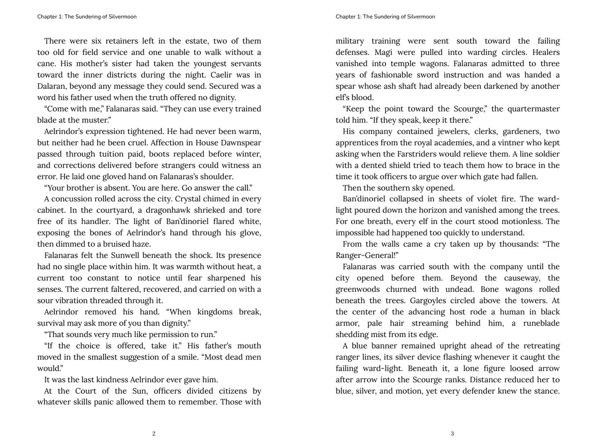

# Example books

Two complete publication packages produced end to end in Lorekeeper. Each
folder is a Lulu paperback package exactly as the **Save package** button
writes it, unmodified, so `manifest.json` still verifies every file by size and
SHA-256.

| File | Contents |
|---|---|
| `interior.pdf` | The print-ready interior, with bleed and trim boxes. |
| `outside-cover.pdf` | The full-wrap cover: back, spine, and front on one page. |
| `manifest.json` | Profile, print settings, and the size and SHA-256 of every file. |
| `preflight.json` | Lorekeeper's validation results, including review warnings. |
| `upload-map.json` | Which file to upload to which slot on the printer's site. |

Both were rendered by Lorekeeper Press 2.1.17.

## My Dad, the Lighthouse Keeper

A rhyming picture book set on a Massachusetts island in the 1930s: a
34-page, 8.5 × 11 in premium-color paperback whose illustrations run
across full-bleed facing spreads, with the verse set over the art.

- [Interior PDF](my-dad-the-lighthouse-keeper/interior.pdf) (46.5 MB)
- [Cover PDF](my-dad-the-lighthouse-keeper/outside-cover.pdf) (3.4 MB)
- Profile: Lulu paperback, premium color on 80# white

## Falanaras, Blood Knight

A 354-page, 6 × 9 in black-and-white novel with a generated contents
page, chapter openers on right-hand pages, justified body text, and a
full-wrap cover with spine type and logos.

*Falanaras, Blood Knight* is an unofficial work of fan fiction. It is not
endorsed by, sponsored by, or affiliated with Blizzard Entertainment, Inc.
Warcraft, World of Warcraft, and all related names, characters, settings,
lore, trademarks, and other intellectual property are the property of Blizzard
Entertainment, Inc. and/or their respective rights holders; no ownership of
those materials is claimed.

- [Interior PDF](falanaras-blood-knight/interior.pdf) (4.8 MB)
- [Cover PDF](falanaras-blood-knight/outside-cover.pdf) (2.1 MB)
- Profile: Lulu paperback, standard black and white on 60# white
